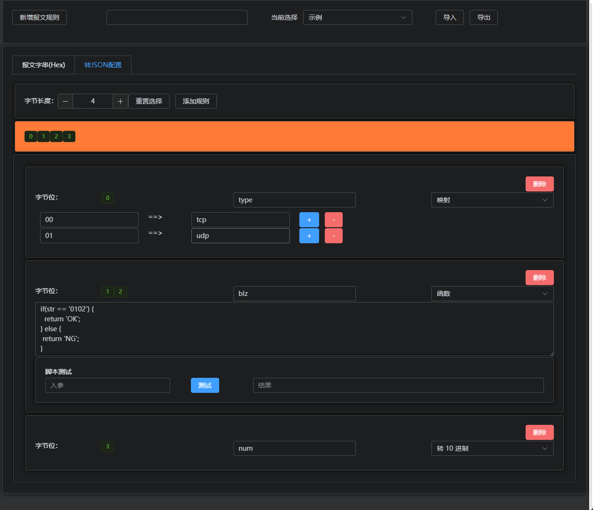
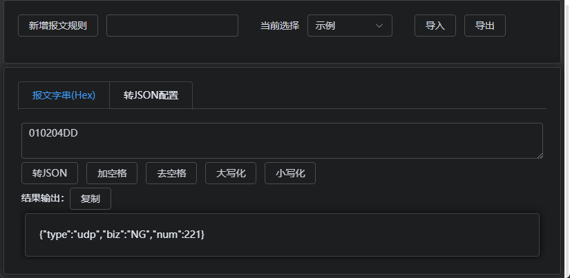

# packet for utools !

## 简介

报文调试小工具，目的是提供报文调试的一些功能方便开发与查找问题。工具主要针对 16 进制字符串表示的报文，对报文进行 Json 转换。

新增报文规则，在【转JSON配置中】定义报文的字节长度（一般以 0A 0B 0C 这样的形式，两个字符代表一个字节位），选中字节位置后进行配置设置。

当前支持的配置有：映射、函数和转 10 进制。

> 函数仅支持一个输入变量，名称是 strt。返回的结果作为 json 的 value。
>
> ```js
> if(str == '0102') {
>   return 'OK';
> } else {
>  return 'NG';
> }
> ```

所有的配置支持本地导出和导入。

## 开始

报文：00 01 02 0B
长度：4
第一位：表示通讯类型，关键字是 type, 00表示 tcp，01 表示 udp。
第二位和第三位连起来表示业务含义，关键字是 biz，自定义函数0102 表示正常，其他异常。
第四位表示 10 进制，关键字是 num。

配置如下：


测试使用：




## TODO LIST

- json 转 报文字串
- 进行协议连接
